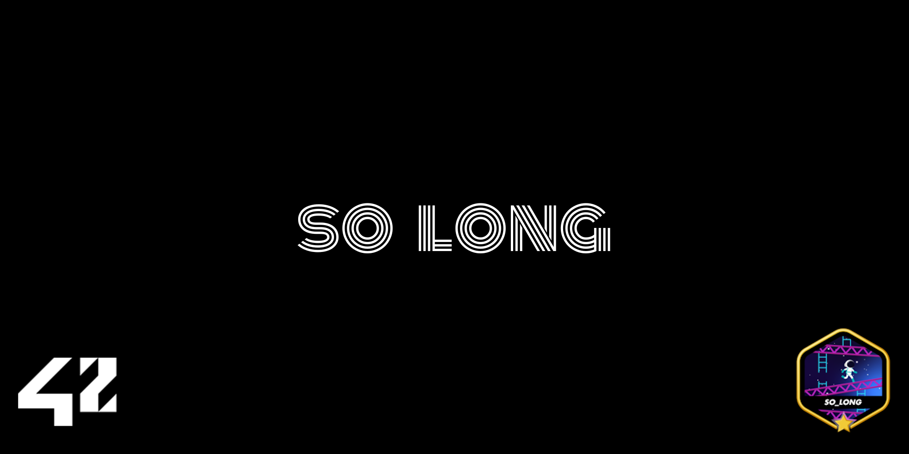
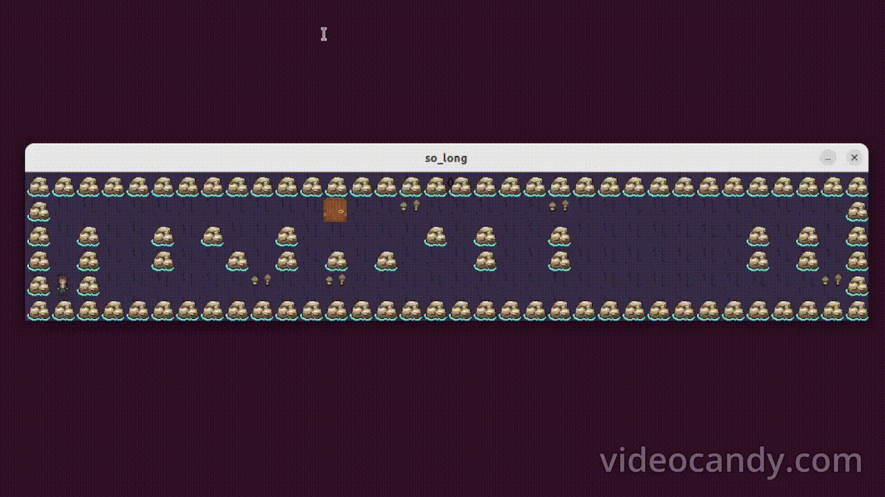

# so_long



Welcome, adventurers and code enthusiasts! I’m excited to share with you my journey through the **so_long** project at 42 Berlin. This challenge ventures beyond simple coding and delves into the realms of 2D graphics, event handling, and game mechanics—all to create a delightful, interactive experience on the screen.

---

## About

**so_long** is not just another exercise; it’s an immersive exploration into graphical programming with the **MiniLibX** library. By implementing a 2D game from scratch, I’ve sharpened my skills in:

- **Window Management & Event Handling:** Opening a window, capturing user inputs, and ensuring seamless interaction.
- **File Parsing & Map Validation:** Reading custom `.ber` map files, checking for correctness, ensuring walls surround the entire map, and verifying proper player, exit, and collectible placements.
- **Pathfinding & Algorithmic Thinking:** Using a **flood fill algorithm** to confirm that the player can reach all collectibles and the exit.
- **Enhanced Gameplay Mechanics (Bonus):** Infusing life into the game with sprite animations and directly displaying the score/move count on the screen.

Throughout this project, I’ve embraced the complexity of integrating logic, graphics, and user experience—all developed and tested on **Linux** machines.

---

## Project Highlights

- **Program Name:** `so_long`
- **Files Submitted:** Makefile, *.h, *.c, maps, textures
- **Makefile Rules:** NAME, all, clean, fclean, re
- **Input:** A `.ber` map file
- **Authorized Functions:** open, close, read, write, malloc, free, perror, strerror, exit, math library functions, MiniLibX functions, ft_printf (or custom equivalent), and Libft functions.

---

## Core Mechanics

Your mission is simple yet engaging:
1. **Collect All Items:** Traverse the map and gather all collectibles (`C`).
2. **Reach the Exit:** Once you have all the items, head towards the exit (`E`).
3. **Respect the Terrain:** Walls (`1`) block your path, so plan your route carefully.
4. **Navigate Thoughtfully:** Use **W, A, S, D** to move up, left, down, and right.  
5. **Quit Cleanly:** Press **ESC** or close the window to exit the game gracefully.

The map characters:
- `0` - Empty space  
- `1` - Wall  
- `C` - Collectible  
- `E` - Exit  
- `P` - Player start position

**Path Validation:** If the map isn’t valid—maybe it’s not rectangular, not fully surrounded by walls, or lacks a reachable path to exit and collect all items—the game will refuse to start, ensuring a solid foundation for an enjoyable gaming experience.

---

## Bonus Features

Why stop at the basics?
- **Sprite Animation:** Characters and elements come alive with animations, adding visual flair.
- **Score Display:** The current score or move count is displayed right on the screen, keeping you connected to your progress at all times.

---




## Getting Started

**Ready to embark on this adventure?** Follow these steps:

1. **Clone the Repository:**
   ```bash
   git clone https://github.com/korberlin/so_long.git
   cd so_long
   ```

2. **Build the Project:**
   ```bash
   make
   ```
   After compilation, you’ll have the `so_long` executable ready to play.

3. **Run the Game:**
   ```bash
   ./so_long maps/example.ber
   ```
   Replace `example.ber` with the path to your own custom map file.

As you step into the world of **so_long**, enjoy the interplay of logic, artistry, and coding finesse. Each step your character takes, each collectible gathered, and each score increment you see on the screen reveals the careful craftsmanship behind the scenes.

---

## Contributing

Have ideas for improvements or new features? Contributions are always welcome! Feel free to open issues, suggest enhancements, or submit pull requests. Let’s evolve **so_long** together, making it an even more captivating and polished experience.


---

**Thank you for exploring my so_long project!** May your journey be filled with discovery, fun, and continuous learning. Enjoy the game and have a blast! 🚀
